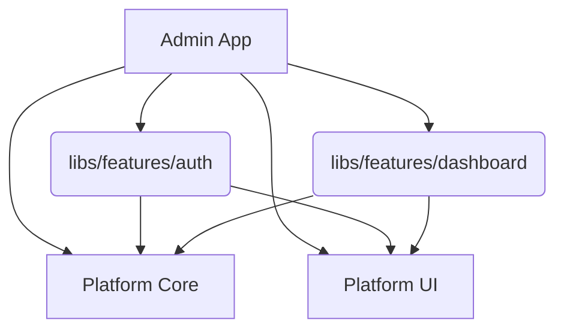

# An Enterprise React Starter Template for the Impatient Developer

This template provides a production-grade, modular boilerplate setup to get a scalable React frontend platform working in Vite with HMR, driven by an NX Monorepo architecture. 

It is designed so that you can easily fork it on GitHub to spin up new, modular multi-tenant applications. Use NPM for package management.

### Includes:
- **ESLint & Prettier** for linting and formatting (NX integrated)
- **Typescript** for robust type safety
- **Tailwind v4 + Material UI (MUI)** for styling and flexible UI components
- **React Router v7** for scalable, dynamic routing and layouts
- **Tanstack Query (React Query)** for data fetching and caching
- **Zustand** for lightweight UI state management
- **NX Monorepo** for clean separation of `apps` and `libs` (features, ui, core)
- **Multi-Tenant Architecture** dynamic loading of tenant-specific features, logos, and runtime theme switching (Dark/Light)
- **Basic Auth Provider + Auth Routes** setup that you can update as per requirement
- **Extensible API Client** with Axios interceptors

### Extras:
- GitHub Actions CI/CD setup
- Dockerfile for production deployment
- Relative imports (`libs/`, `apps/`) handled via `tsconfig.base.json` aliases

---

## Usage

Run the command to clone the repo without git history.

```bash
# Run the command to clone the repo without git history.
npx degit your-github-user/your-enterprise-template <YOUR_PROJECT_NAME>

cd <YOUR_PROJECT_NAME>

# get rid of .gitkeep files 
npx del-cli del **/.gitkeep

# initialize git
git init

# connect to github
git remote add origin <GIT_REPO_URL>
```

---

## Commands

```bash
# install dependencies during development
npm install

# or
npm run install:ci

# install dependencies in production environment
npm run install:prod

# start dev server on port 4200 (NX default)
npm run dev

# start dev server and host it on local network
npm run dev:host

# format files
npm run format

# lint 
npm run lint

# build the admin application
npm run build

# preview the created build
npm run preview
```

---

## Architecture Overview

The platform follows a modular, feature-driven scalable architecture using NX monorepo.

### Folder Structure
- `apps/admin` - Contains the runnable admin application.
- `libs/platform/core` - Core abstractions, context providers (Auth, Tenant), routing registry, and API layers.
- `libs/platform/ui` - Reusable UI components, Layouts, Theme providers (MUI + Tailwind).
- `libs/features/*` - Self-contained feature modules (auth, dashboard, users, settings).

### Architecture Diagram



### Adding a New Feature Module

Use NX generators to create a new library and keep things modular:
```bash
npx nx g @nx/react:lib libs/features/my-new-feature --bundler=vite --unitTestRunner=vitest --style=css
```

---

## Notes
- This template relies on NPM workspaces managed via NX. Ensure your node version is `>=20.0.0` as specified in the engines block.
- If you prefer Yarn or pnpm, ensure you remove `package-lock.json` and generate the appropriate lock file using your preferred manager, but remember to update the NX configurations accordingly.

## Useful references
- [NX Monorepo Docs](https://nx.dev/)
- [React Router v7 Docs](https://reactrouter.com/)
- [MUI Components](https://mui.com/material-ui/getting-started/)
- [Data fetching using Tanstack Query](https://tanstack.com/query/latest)
- [Zustand State Management](https://github.com/pmndrs/zustand)
